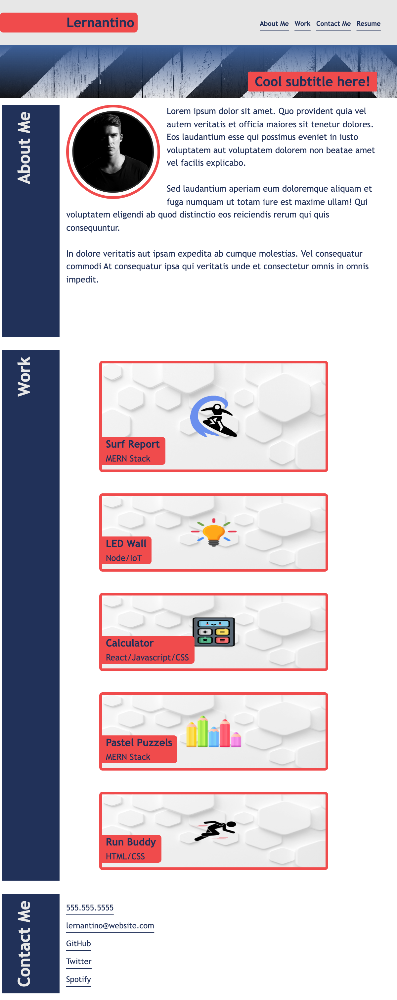

# 02-portfolio-page-challenge

# Demo Portfolio Page

## Description
A marketing agency, Horiseon, want a codebase that follows accessibility standards, so that their website is optimized for search engines.

## Summary of Changes
Page made in accordance to the acceptance criteria.
- When the page is loaded the page presents the name Adebayo, an avatar, and links to sections About Me, My Work, and Contact Me Info.
- When one of the links in the navigation is clicked, the UI scrolls to the corresponding section.
- When viewing the section about my work, the section contains titled images of my applications.
- When presented with the first application the application's image is larger in size than the others.
- When images of the applications are clicked, the user is taken to that deployed application.
- When the page is resized or viewed on various screens and devices then the layout is responsive and adapts to my viewport. Views optimised using Media Query: 360px-600px, 601px-1050px, 1051px-2500px and >2500px

## Demo Portfolio Page
The following images shows the Demo Portfolio Page appearance in different device sizes.

> **Note** This is a screenshot of the Demo Portfolio Page at 600px.

> **Note** This is a screenshot of the Demo Portfolio Page at 1050px.

> **Note** This is a screenshot of the Demo Portfolio Page at 2000px.

> **Note** TThis is a screenshot of the Demo Portfolio Page at >2500px.

## License
Licensed under the MIT License

## GitHub Repository
URL: https://github.com/adebayoadebisi/02-portfolio-page-challenge 

## Deployed Web Application